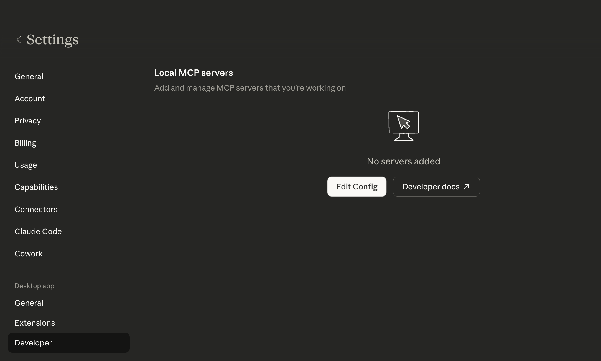
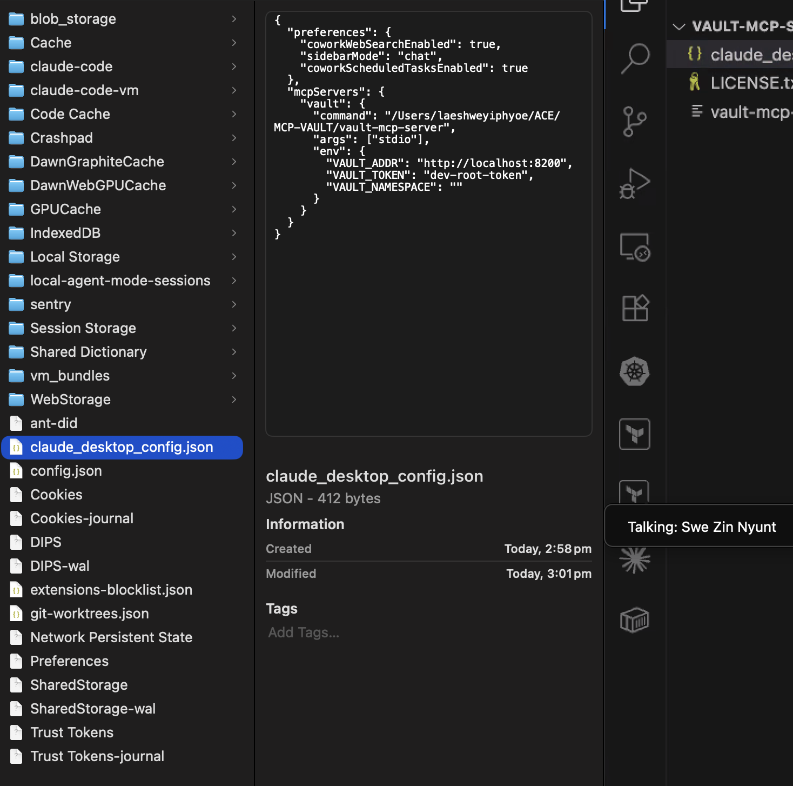
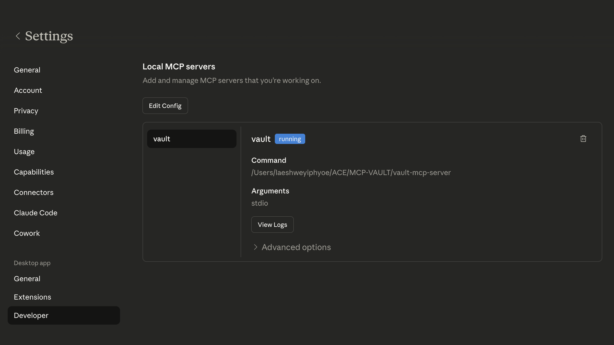
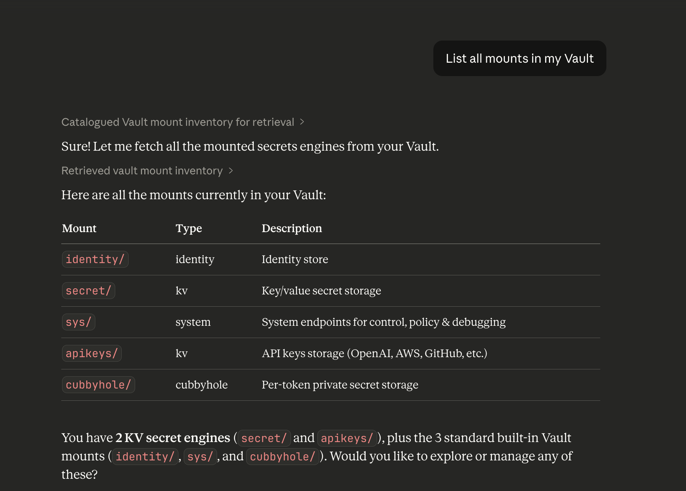
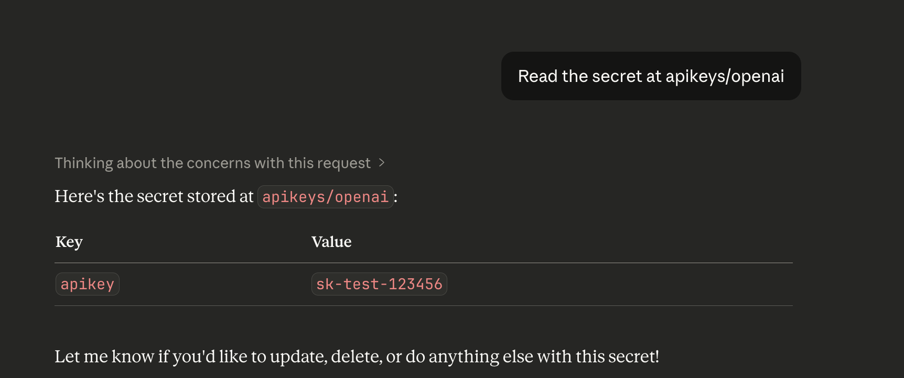
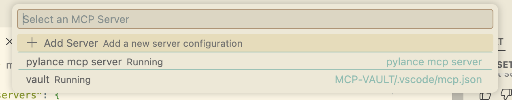
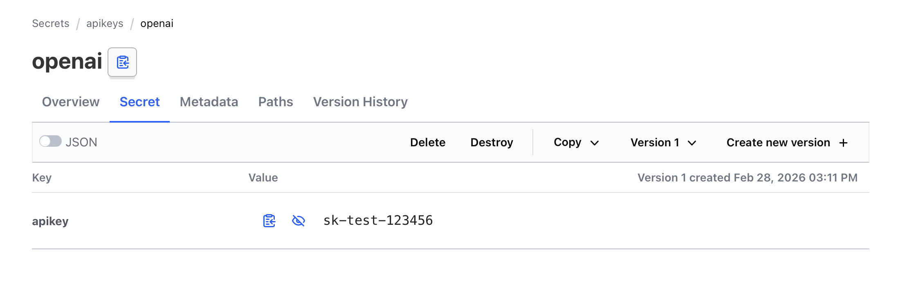

# MCP Vault Project

This project demonstrates how to use HashiCorp Vault with Claude Desktop via MCP (Model Context Protocol).

## Features
- Securely store and manage secrets (API keys, credentials, etc.)
- Connect Vault to Claude Desktop for natural language secret management
- Example config files for easy setup

## Setup Instructions

### 1. Start Vault
Make sure Vault is running locally:
```bash
vault server -dev
```
This starts Vault in development mode. **In dev mode, Vault automatically sets the root token to `dev-root-token`.**

You will see output like:
```
Root Token: dev-root-token
```

**Note:** In production, you will initialize Vault and get a different token. For testing and local development, `dev-root-token` is safe and convenient.

### 2. Configure Claude Desktop
- Copy `claude_desktop_config.json` to `~/Library/Application Support/Claude/claude_desktop_config.json`
- Quit and relaunch Claude Desktop
- Go to **Settings → Developer** and check that `vault` is listed

### 3. Store and Read Secrets
- Use Claude Desktop chat to store/read secrets:
  - "Store my OpenAI key in Vault"
  - "Read the secret at apikeys/openai"

## How the Vault Token Works
- The token in your config (`dev-root-token`) matches the token Vault prints when started in dev mode.
- If you restart Vault, check the terminal for the new token and update your config if needed.
- For production, use a secure token and never commit it to source control.

## Visual Guide

### Go to Developer Settings


### Press Edit Config


### Quit and Relaunch Claude Desktop


### List Vault Mounts


### Read a Secret


### Searching for MCP


### Test Value


## Files
- `claude_desktop_config.json`: Claude Desktop MCP config example
- `assets/`: Screenshots for setup and usage

## License
See LICENSE.txt for details.
